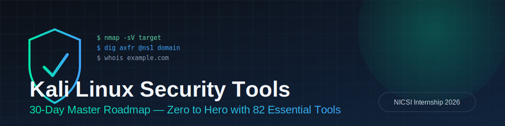

<p align="center">
  
</p>

<h1 align="center">🛡️ Kali Linux Security Tools Bootcamp</h1>
<p align="center"><b>30-Day Intensive Roadmap · Zero to Hero with 82 Essential Tools</b></p>

<p align="center">
  
  
  
  
</p>

<p align="center">
  
  
  
</p>

---

## 📖 About This Roadmap

This repository documents a **30-day, structured learning path** through the core tools and concepts used across the entire cyber security assessment lifecycle — from Linux fundamentals and networking, through reconnaissance, vulnerability assessment, web security, password auditing, wireless security, network analysis, exploitation, digital forensics, reverse engineering, OSINT, and automation.

It's designed for:

- 🎓 Cyber Security Beginners
- 🧑‍💻 SOC Analysts
- 🎯 Penetration Testers
- 🔧 Security Engineers
- ⚙️ DevSecOps Professionals

> ⚠️ **Authorized Use Only.** This roadmap is intended for learning in an **isolated lab environment** or on systems you own / have **explicit written authorization** to test. Never run any of these tools against systems, networks, or accounts you don't have permission to assess.

---

## 🗺️ At a Glance

| | |
|---|---|
| 🕒 **Duration** | 30 Days (4 Weeks) |
| ⏱️ **Daily Commitment** | 5–6 Hours |
| 🧰 **Tools Covered** | 82 |
| 📦 **Categories** | 11 (Linux & Automation, Info Gathering, Vuln Assessment, Web Security, Passwords, Wireless, Network Analysis, Exploitation, Forensics, Reverse Engineering, OSINT) |
| 🏁 **Capstone** | End-to-end lab assessment + professional report |

---

## 🧭 Roadmap Overview

```
Week 1  →  Linux, Networking & Reconnaissance
Week 2  →  Vulnerability Assessment & Web Security
Week 3  →  Passwords, Wireless & Network Analysis
Week 4  →  Exploitation, Forensics, Reverse Engineering, OSINT & Automation
```

### 📅 Week 1 — Linux, Networking & Reconnaissance

| Day | Focus | Tools |
|---|---|---|
| 1 | Linux Fundamentals — installation, filesystem, permissions, users/groups, package management | `Bash` `tmux` |
| 2 | Networking Fundamentals — OSI, TCP/IP, DNS, HTTP/HTTPS, SSH | `curl` `jq` `Netcat` |
| 3 | Network Discovery — host discovery, port scanning, service/OS detection | `Nmap` `Masscan` `Netdiscover` |
| 4 | DNS & OSINT — DNS enumeration, zone info, domain intelligence | `Whois` `DNSRecon` `Fierce` |
| 5 | Advanced Reconnaissance — email enum, subdomain discovery, asset mapping | `theHarvester` `Recon-ng` `Amass` `Maltego CE` |
| 6 | Practice Lab — full recon of a lab environment + report | — |
| 7 | Weekly Assessment — review, challenges, notes | — |

### 📅 Week 2 — Vulnerability Assessment & Web Security

| Day | Focus | Tools |
|---|---|---|
| 8 | Infrastructure scanning & CVE detection | `OpenVAS` `Nikto` |
| 9 | Web fingerprinting & template-based checks | `Nuclei` `WhatWeb` `Wapiti` `SSLScan` `Legion` `Lynis` |
| 10 | Proxy, repeater, request/response analysis | `Burp Suite CE` `OWASP ZAP` |
| 11 | Content & directory discovery | `Gobuster` `Dirsearch` `ffuf` `Feroxbuster` |
| 12 | SQLi, XSS, command injection, CMS assessment | `SQLmap` `XSStrike` `Commix` `WPScan` |
| 13 | Mini Project — assess a vulnerable lab app + report | — |
| 14 | Weekly Review | — |

### 📅 Week 3 — Passwords, Wireless & Network Analysis

| Day | Focus | Tools |
|---|---|---|
| 15 | Hash ID & offline password recovery | `John the Ripper` `Hashcat` |
| 16 | Online password auditing & wordlist generation | `Hydra` `Medusa` `CeWL` `Crunch` `CUPP` `Hash-Identifier` |
| 17 | Wireless architecture, WPA/WPA2, monitoring | `Aircrack-ng` `Wifite` `Kismet` |
| 18 | Wireless security, rogue AP, WPS testing | `Bettercap` `Reaver` `Bully` `Airgeddon` `hcxdumptool` |
| 19 | Packet capture & protocol analysis | `Wireshark` `Tcpdump` `Ettercap` `Netcat` `Socat` `Driftnet` |
| 20 | SOC Lab — analyze PCAPs, spot suspicious traffic | — |
| 21 | Weekly Assessment | — |

### 📅 Week 4 — Exploitation, Forensics, Reverse Engineering, OSINT & Automation

| Day | Focus | Tools |
|---|---|---|
| 22 | Exploitation framework & vuln validation | `Metasploit Framework` `Searchsploit` |
| 23 | AD assessment & post-exploitation (lab) | `CrackMapExec` `Impacket` `RouterSploit` `BeEF` `Empire` |
| 24 | Disk, memory & metadata forensics | `Autopsy` `Sleuth Kit` `Volatility` `ExifTool` |
| 25 | File recovery & firmware analysis | `Foremost` `Scalpel` `Binwalk` |
| 26 | Static/dynamic binary analysis | `Ghidra` `Radare2` `GDB` `Objdump` `Strings` `Ltrace` |
| 27 | OSINT & digital footprint analysis | `SpiderFoot` `Sherlock` `Photon` `PhoneInfoga` `Holehe` `GHunt` |
| 28 | Security automation & reporting | `Python` `Bash` `curl` `jq` `tmux` |
| 29 | 🏆 **Capstone Project** — full recon → assessment → analysis → reporting | — |
| 30 | Final Review — revision, mock interview, portfolio, resume | — |

---

## 🧰 82-Tool Checklist by Category

<details>
<summary><b>🐧 Linux & Automation (5)</b></summary>

- [ ] Bash
- [ ] Python
- [ ] curl
- [ ] jq
- [ ] tmux
</details>

<details>
<summary><b>🔍 Information Gathering (10)</b></summary>

- [ ] Nmap
- [ ] Masscan
- [ ] Netdiscover
- [ ] Whois
- [ ] DNSRecon
- [ ] Fierce
- [ ] theHarvester
- [ ] Maltego CE
- [ ] Recon-ng
- [ ] Amass
</details>

<details>
<summary><b>🩹 Vulnerability Assessment (8)</b></summary>

- [ ] OpenVAS
- [ ] Nikto
- [ ] Nuclei
- [ ] WhatWeb
- [ ] Wapiti
- [ ] SSLScan
- [ ] Legion
- [ ] Lynis
</details>

<details>
<summary><b>🌐 Web Security (10)</b></summary>

- [ ] Burp Suite
- [ ] OWASP ZAP
- [ ] Gobuster
- [ ] Dirsearch
- [ ] SQLmap
- [ ] XSStrike
- [ ] Commix
- [ ] WPScan
- [ ] ffuf
- [ ] Feroxbuster
</details>

<details>
<summary><b>🔑 Password Security (8)</b></summary>

- [ ] John the Ripper
- [ ] Hashcat
- [ ] Hydra
- [ ] Medusa
- [ ] CeWL
- [ ] Crunch
- [ ] CUPP
- [ ] Hash-Identifier
</details>

<details>
<summary><b>📶 Wireless Security (8)</b></summary>

- [ ] Aircrack-ng
- [ ] Kismet
- [ ] Wifite
- [ ] Reaver
- [ ] Bully
- [ ] Bettercap
- [ ] Airgeddon
- [ ] hcxdumptool
</details>

<details>
<summary><b>📡 Network Analysis (7)</b></summary>

- [ ] Wireshark
- [ ] Tcpdump
- [ ] Ettercap
- [ ] Netcat
- [ ] Socat
- [ ] Driftnet
- [ ] Bettercap (network features)
</details>

<details>
<summary><b>💥 Exploitation Frameworks (7)</b></summary>

- [ ] Metasploit Framework
- [ ] Searchsploit
- [ ] BeEF
- [ ] RouterSploit
- [ ] CrackMapExec
- [ ] Impacket
- [ ] Empire (Lab)
</details>

<details>
<summary><b>🧪 Digital Forensics (7)</b></summary>

- [ ] Autopsy
- [ ] Sleuth Kit
- [ ] Volatility
- [ ] Foremost
- [ ] Binwalk
- [ ] Scalpel
- [ ] ExifTool
</details>

<details>
<summary><b>🧬 Reverse Engineering (6)</b></summary>

- [ ] Ghidra
- [ ] Radare2
- [ ] GDB
- [ ] Objdump
- [ ] Strings
- [ ] Ltrace
</details>

<details>
<summary><b>🕵️ OSINT (6)</b></summary>

- [ ] SpiderFoot
- [ ] Sherlock
- [ ] Photon
- [ ] PhoneInfoga
- [ ] Holehe
- [ ] GHunt
</details>

---

## 🎯 Expected Outcomes

By the end of this 30-day program, you should be able to:

- ✅ Confidently use all **82 core tools** in authorized lab environments
- ✅ Understand the full phases of a security assessment — recon → assessment → exploitation → reporting
- ✅ Analyze network traffic, assess web applications, and perform basic digital forensics
- ✅ Automate repetitive security tasks with Python and Bash
- ✅ Build a **portfolio of lab reports and scripts** demonstrating practical, job-ready skills

---

## 🧱 Suggested Repo Structure

```
kali-30-day-roadmap/
├── README.md
├── week-1-linux-networking-recon/
│   ├── day-01-linux-fundamentals.md
│   ├── day-02-networking-fundamentals.md
│   ├── day-03-network-discovery.md
│   ├── day-04-dns-osint.md
│   └── day-05-advanced-recon.md
├── week-2-vuln-web-security/
├── week-3-passwords-wireless-network/
├── week-4-exploitation-forensics-re-osint/
├── reports/            # Lab & capstone reports
├── scripts/            # Automation scripts (Python/Bash)
└── notes/              # Personal study notes
```

---

## ⚖️ Legal & Ethical Disclaimer

All tools and techniques in this roadmap are for **educational purposes** within **isolated labs** or against systems you **own or are explicitly authorized** to test. Unauthorized scanning, exploitation, or access of systems you do not have permission to test is **illegal** in most jurisdictions. The author/program is not responsible for misuse.

---

<p align="center">
  <sub>Built for the <b>NICSI Internship Program 2026</b> · Cyber Security Track</sub>
</p>
